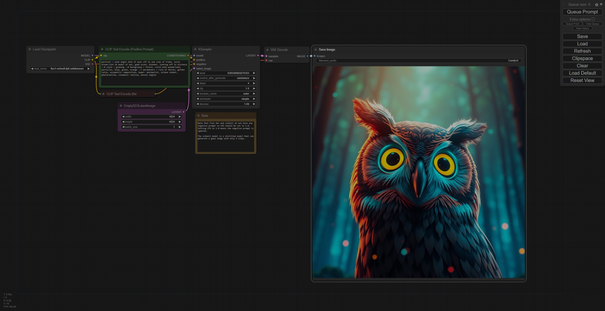

[← Go back](../README.md)

<header style="display: flex; align-items: center; justify-content: center; background: center url('assets/banner.png'); padding: 5rem 0;">
    <div style="background-color: rgba(0,0,0,0.75); border-radius: 0.3rem; padding: 0.5rem 1.25rem;">
        <h1>ComfyUI Universal</h1>
        <h4>A dockerized environment for running image generation AI's easily.⚡</h4>
        <p align="center">
            <a href="#description">Description</a> •
            <a href="#requirements">Requirements</a> •
            <a href="#pre-installation-steps">Pre-installation Steps</a> •
            <a href="#installation">Installation</a>
            <br>
            <a href="#execution">Execution</a> •
            <a href="#configuration">Configuration</a> •
            <a href="#storage">Storage</a> •
            <a href="#known-issues">Known Issues</a> •
            <a href="#credits">Credits</a>
        </p>
    </div>
</header>

## Description

This folder is made for running ComfyUI easily on Docker, providing an easy configuration that can be adapted for image generation AI's. The default configuration and some parts of this [README](README.md) are based on the `Flux.1-Schnell FP8` model.

## Requirements

|                | Required                           | Recommended                        |
| -------------- | ---------------------------------- | ---------------------------------- |
| `GPU`          | NVIDIA (with CUDA)                 | NVIDIA (with CUDA)                 |
| `GPU VRAM`     | 4 GB                               | 8 GB                               |
| `CPU`          | 4 cores/threads                    | 8 cores/threads                    |
| `DRAM`         | 16 GB                              | 32 GB                              |
| `Disk space`   | 30 GB                              | 50 GB                              |
| `CUDA Toolkit` | Required (not required for Docker) | Required (not required for Docker) |

## Pre-installation Steps

### Linux

1.  **Install NVIDIA Container Toolkit**:

    - Refer to the [official documentation](https://docs.nvidia.com/datacenter/cloud-native/container-toolkit/latest/install-guide.html#installing-nvidia-container-toolkit) for detailed instructions.

2.  **Verify NVIDIA driver version**: Ensure that you are running the newest compatible version of the NVIDIA driver.

### Windows

1.  **Verify NVIDIA driver version**: Ensure that you are running the newest compatible version of the NVIDIA driver.

## Installation

1.  **Clone the main repository**:

    ```bash
    git clone https://github.com/TD99/ai-sandbox.git
    cd ai-sandbox/comfyui-universal
    ```

2.  **Install dependencies**:

    ```bash
    docker-compose build
    ```

## Execution

1.  **Run ComfyUI**:

    ```bash
    sudo docker-compose up [-d]
    ```

2.  **Access ComfyUI**: Open a web browser and navigate to <http://localhost:8188/>

3.  **Load models in correct workflow**: Click on "Load" in ComfyUI, select [`owl.json`](examples/owl.json).

## Configuration

[`models.json`](config/models.json) - Defines all model files that need to be loaded.

| Property      | Description                                                  |
| ------------- | ------------------------------------------------------------ |
| `name`        | Filename                                                     |
| `displayName` | Display name                                                 |
| `description` | Short description                                            |
| `version`     | Version                                                      |
| `license`     | License                                                      |
| `origin`      | URL from where to download                                   |
| `location`    | Location in ComfyUI (use `@` for root folder `/app/ComfyUI`) |

[`.env`](config/.env) - Defines settings.

| Variable            | Description                                   |
| ------------------- | --------------------------------------------- |
| `PROJECT_ROOT`      | Defines ComfyUI root folder                   |
| `OVERRIDE_MODELS`   | Always download models anew                   |
| `MODEL_CONFIG_PATH` | Path to [`models.json`](config/models.json)   |
| `BEFORE_DEPLOY_CMD` | Command to run before deployment              |
| `AFTER_DEPLOY_CMD`  | Command to run after deployment               |
| `TIMEOUT_RETRIES`   | Number of retries for downloading model files |

## Storage

[`.models`](.models) folder - All models are downloaded to the [`.models`](.models) folder.

## Known Issues

- **Windows Validation Issue**: Validation sometimes fails in Windows.  
  **Solution**: Change line endings from CRLF to LF in [`check_compatibility.sh`](scripts/check_compatibility.sh), or set `BEFORE_DEPLOY_CMD` to empty in [`.env`](config/.env).

- **Model Download Issue**: After downloading a model, no action occurs.  
  **Solution**: Force quit the container using `CTRL+C` twice and start again.

## Screenshots

### ComfyUI in action



## Credits

**Original Project**: [ComfyUI](https://github.com/comfyanonymous/ComfyUI) is a product of [Comfy Org](https://www.comfy.org/).

**Dockerization and Optimization**: This project was created by [TD99](https://github.com/TD99) with contributions from other developers in the open-source community.

**Codebase and Dependencies**:  
[NVIDIA Container Toolkit](https://github.com/NVIDIA/nvidia-container-toolkit): A product of NVIDIA Corporation.  
[Docker](https://github.com/docker): A containerization platform developed by Docker Inc.

# [<button style="border: 0; padding: 0.75rem 1rem; border-radius: 0.5rem;">↑ Go up</button>](#)
